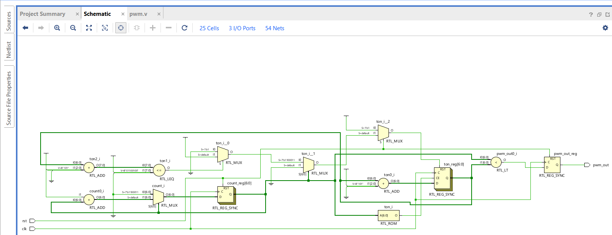
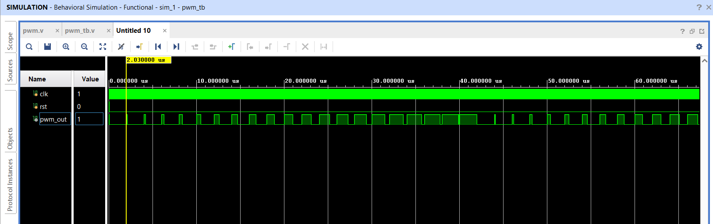

# PWM Generator using Verilog HDL

[](#)
[](#)
[](LICENSE)

## Overview

Pulse Width Modulation (PWM) is a technique used to control the average power delivered to a load by varying the duty cycle of a digital signal while keeping the frequency constant.
A parameterized Pulse Width Modulation (PWM) Generator is designed in Verilog HDL within Xilinx Vivado design suite. It generates a PWM signal whose duty cycle automatically increases by a fixed step after every PWM period, and resets back to 0% once it reaches the maximum duty cycle.

This implementation demonstrates:
- Parameterized PWM period and step size
- Automatic duty cycle increment for every PWM period
- Synchronous active-high reset
- Synthesizable RTL design
- Behavioral simulation using Vivado

## Schematic
The figure below is the synthesized RTL schematic generated by Vivado for `pwm.v`, showing the counter (`count_reg`), duty-cycle register (`ton_reg`), the comparator driving `pwm_out`, and the associated adders and multiplexers that implement the increment-and-wrap logic.
<p align="center">
  
</p>

## Module Interface

| Port | Direction | Description |
|------|-----------|-------------|
| `clk` | Input | System clock |
| `rst` | Input | Active-high synchronous reset |
| `pwm_out` | Output (reg) | PWM output signal |

## Parameters

| Parameter | Description | Assigned in the source code |
|-----------|-------------|---------|
| `PERIOD` | PWM period, in clock cycles | 100 |
| `STEP` | Duty cycle increment per period (in clock cycles) | 5 |

> **Note:** The internal `count` and `ton` registers are declared as `[6:0]` (7-bit, range 0–127). If `PERIOD` is increased beyond 127, widen these registers accordingly to avoid overflow or wraparound. 

## Working Principle

The PWM generator consists of:
- A free-running counter (`count`) that increments every clock cycle.
- A duty-cycle register (`ton`) that stores the ON duration, in clock cycles.

The output is driven synchronously each clock edge:
```text
pwm_out <= (count < ton) ? 1 : 0;
```
At the end of every PWM period (when `count == PERIOD - 1`):
- `count` resets to 0.
- `ton` increases by `STEP`, provided `ton + STEP <= PERIOD`.
- If incrementing `ton` would exceed `PERIOD`, `ton` resets to 0 and the ramp starts over.

On `rst` (active-high, synchronous): `count`, `ton`, and `pwm_out` are all cleared to 0 on the next clock edge.

## Duty Cycle Behavior

Duty cycle is given by:
```text
Duty (%) = (ton / PERIOD) × 100
```

With the default parameters (`PERIOD = 100`, `STEP = 5`), `ton` ramps as:

```
0 → 5 → 10 → 15 → ... → 95 → 100 → 0 (repeat)
```
This produces a duty cycle that steps from **0% to 100% with increments of 5%** once, per PWM period, before resetting and repeating the ramp.

## Testbench

`pwm_tb.v` instantiates the `pwm` module with default parameters and applies the following stimulus:

- **Clock:** toggled every 10 ns → 20 ns period (**50 MHz**).
- **Reset:** held high for the first 20 ns, then deasserted for the remainder of the run.
- **Run length:** simulation runs for 35,000 ns (35 µs) before calling `$finish`.

At 50 MHz with `PERIOD = 100`, one full PWM period = 100 × 20 ns = **2,000 ns (2 µs)**. The 35 µs test window therefore captures roughly **17 PWM periods**.

## Simulation Results

The waveform below is captured from the Vivado XSIM behavioral simulation, showing `clk`, `rst`, and `pwm_out`. After the initial reset pulse, `pwm_out` starts with a narrow high pulse each period and widens progressively as `ton` steps upward every PWM period, visually confirming the duty-cycle ramp described above.
<p align="center">
  
</p>

## Possible Enhancements
- Runtime programmable duty cycle (via input port instead of auto-ramp)
- Variable PWM frequency
- Enable input
- AXI/APB interface for SoC integration
- Testbench improvements: `$dumpfile`/`$dumpvars` for waveform export, and assertions to self-check duty cycle progression

## Author

**Bhoomika P**

M.Tech in VLSI and Nanotechnology  
Ramaiah University of Applied Sciences, Bengaluru

## License
This project is released under the [MIT License](LICENSE).
